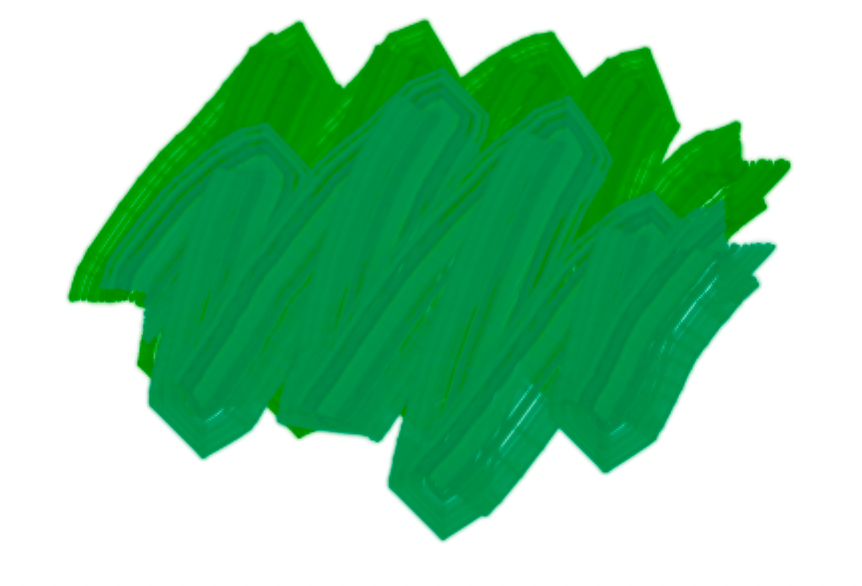
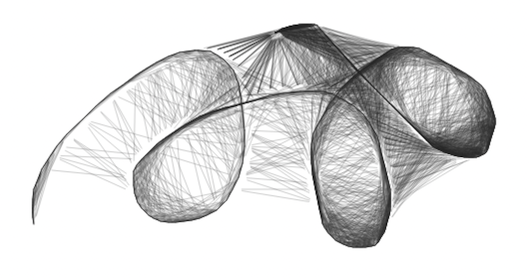
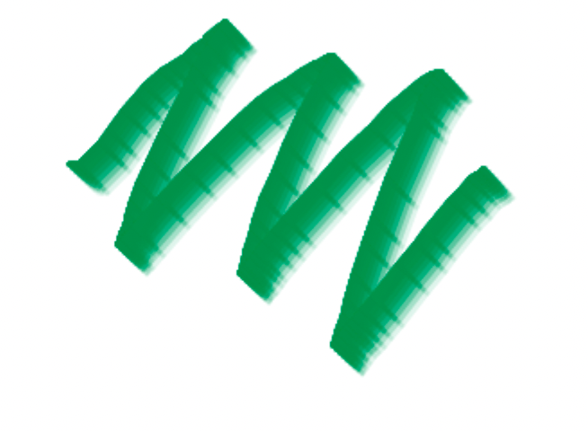
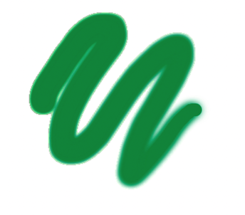

# react-artboard

A freeform sketching component for React


react-artboard includes an `Artboard` component and several tools, including a realistic paintbrush, a marker pen and airbrush, as well as the abstract shading tool. Tools are implemented as custom hooks, so you can add your own brushes and other tools.

[Try the demo](https://react-artboard.netlify.app/)

## Installation

```shell
npm install react-artboard
```

## Usage

For a full usage example, see [this file](https://github.com/ascorbic/react-artboard/blob/main/example/App.tsx). 
The simplest usage of the component is like this:

```jsx
import React from "react";
import { useBrush, Artboard } from "react-artboard";
export function App() {
  const brush = useBrush({ color: "#663399", strokeWidth: 40 });

  return <Artboard tool={brush} style={{ width: 800, height: 600 }} />;
}
```

You probably want to allow users to change the colors and size of the brush.
Here is an example that uses native `color` and `range` inputs:

```jsx
import React, { useState } from "react";
import { useBrush, Artboard } from "react-artboard";
export function App() {
  const [color, setColor] = useState("#993366");
  const [strokeWidth, setStrokeWidth] = useState(40);
  const brush = useBrush({ color, strokeWidth });

  return (
    <main>
      <div>
        <input
          type="color"
          value={color}
          onInput={(evt) => setColor(evt.currentTarget.value)}
        />
        <input
          type="range"
          min={5}
          max={50}
          value={strokeWidth}
          onInput={(evt) => setStrokeWidth(parseInt(evt.currentTarget.value))}
        />
      </div>
      <Artboard tool={brush} style={{ width: 800, height: 600 }} />
    </main>
  );
}
```

You could use a custom component instead of these inputs if you want more
control over them, as long as they return a number for the brush size and a
string for the color.

If you want to export your creations or clear the canvas, you can use the ref
like this:

```jsx
import React, { useState } from "react";
import { useBrush, Artboard } from "react-artboard";
export function App() {
  const [color, setColor] = useState("#993366");
  const [strokeWidth, setStrokeWidth] = useState(40);
  const brush = useBrush({ color, strokeWidth });

  const [artboardRef, setArtboardRef] = useState();

  return (
    <main>
      <div>
        <button onClick={() => artboardRef?.download()}>Download</button>
        <button onClick={() => artboardRef?.clear()}>Clear</button>
        <input
          type="color"
          value={color}
          onInput={(evt) => setColor(evt.currentTarget.value)}
        />
        <input
          type="range"
          min={5}
          max={50}
          value={strokeWidth}
          onInput={(evt) => setStrokeWidth(parseInt(evt.currentTarget.value))}
        />
      </div>
      <Artboard tool={brush} style={{ width: 800, height: 600 }} />
    </main>
  );
}
```

## API

### `Artboard`

#### Props

- **`tool`**

  This is the tool returned by the `useBrush()` hook. You can also implement your own tools and pass them in here.

- **`ref`**

  This accepts a callback that will be passed a ref that you can use to make the following calls:

    - **`download`**: `(filename: string, type: string) => void`
      
      Downloads the canvas as an image. You can pass in a filename (default "image.png"), and a mimetype (default "image/png"). If you pass an unsupported type it will fallback to PNG.
    - **`getImageAsDataUri`**: `(type: string) => string | undefined`

      Returns the image as a data URI, which can be displayed in an `` tag for example.
    - **`clear`**: `() => void`
        
      Clears the image

### Paintbrush

`useBrush(options)`




#### Options
- **`color`** A CSS string color.
- **`strokeWidth`** The width of the brush

### Shading

`useShadingBrush()`

This tools is inspired by [some blog posts](#sources), exploring the use of "neighbour point" sketching. It gives a fun, unusual effect that is similar to pencil shading. It is highly configurable, giving quite different effects according to the different parameters.




#### Options
- **`color`** A CSS string color. _Default: `#000000`_
- **`spreadFactor`** The length of the connecting line. A value of `1` means it exactly joins the two points, while `0.5` only covers half the distance. A value above `1` gives a "fur" effect as the line extends beyond the points. _Default: 0.9_
- **`distanceThreshold`** How near the point needs to be to join, in pixels. _Default: 50_
- **`neighbourStrokeWidth`** Width of the stroke joining the points. _Default: 1_
- **`neighbourColor`** Color of the line joining the points. _Default: `color` value with 0.2 alpha_

### Marker pen

`useMarker(options)`


#### Options
- **`color`** A CSS string color.
- **`strokeWidth`** The width of the brush

### Airbrush

`useAirbrush(options)`


#### Options
- **`color`** A CSS string color.
- **`strokeWidth`** The width of the brush

## Custom brushes

See the source for `useBrush` to see how to create a brush. It must return an object, with the following optional callbacks:

- **`startStroke?`**: `(point: Point, context: CanvasRenderingContext2D) => void`
- **`continueStroke?`**: `(point: Point, context: CanvasRenderingContext2D) => void`
- **`endStroke?`**: `(context: CanvasRenderingContext2D) => void`
- **`cursor?`**: `string`
  A CSS-compatible string for the cursor to display. You can use the `circleCursor()` helper to display a resizable circle for the cursor


## History

The `useHistory()` hook allows undo/redo functionality. Pass it a `size` value to limit the size of the history stack. It returns and object with the following:

- **`history`**: The `History` object. Pass this to the `Artboard`.
- **`undo()`**: Reverts the image to the previous state.
- **`redo()`**: Move forward in history, if available.
- **`canUndo`**: History is available to undo
- **`canRedo`**: History is available to redo


© Copyright [Matt Kane](https://mk.gg) ([@ascorbic](https://github.com/ascorbic)) 2021. MIT Licence

## Sources
These posts gave inspirsation, particularly for the shading tool.
- [Exploring canvas drawing techniques](http://perfectionkills.com/exploring-canvas-drawing-techniques/)
- [Harmony brush adoption in Krita: Sketch](http://lukast.mediablog.sk/log/?p=347)